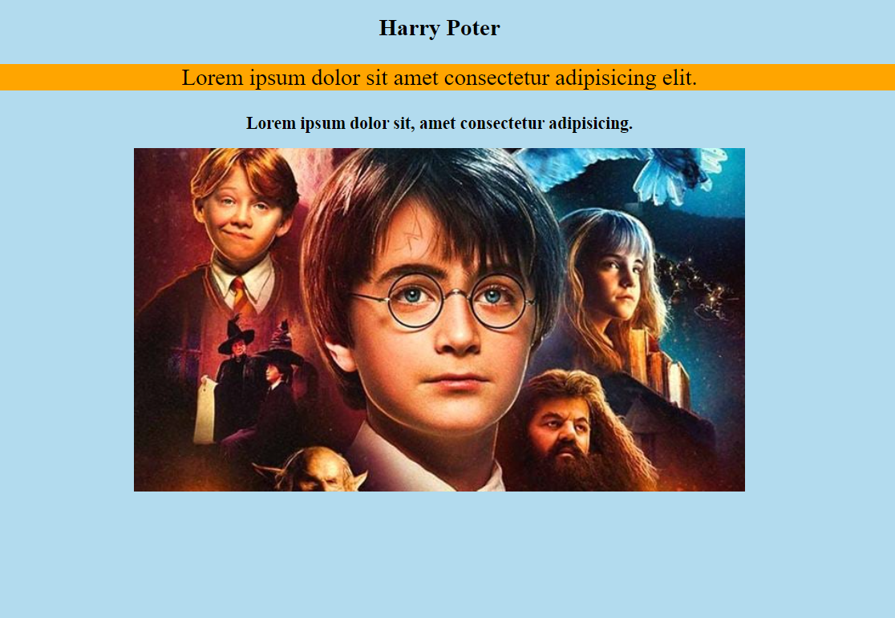

# Harry Potter Image-Text Center

visit: https://aokmen.github.io/harry-poter/

# HTML Code Description
### The following HTML code creates a webpage with the following components: A heading tag with the content "Harry Potter". A paragraph tag with the content "Lorem ipsum dolor sit amet consectetur adipisicing elit." and a style attribute to set the font size to 2rem and the background color to orange. A second heading tag with the content "Lorem ipsum dolor sit, amet consectetur adipisicing.". An image tag  that displays the image located at the URL with the alternate text "Harry Potter" and a width of 40%. A style tag 

